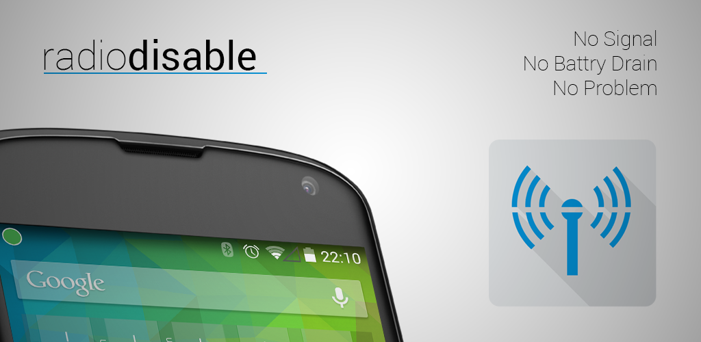

Radio Disable
=============

Description
-----------
No Root Required,
When in a low to no signal area, android will use a large amount of battery to try to maintain a Mobile network connection, if like me you use wifi calling in those areas, or you simply want to keep your battery from draining when you can't get wifi connection anyway. This is the app for you.

Simply open the configuration screen, select the WiFi networks on which you wish to disable the mobile network, and enable the service.

Every time your device is active on one of your chosen networks the Mobile Radio will be fully disabled, saving your device from needing to power the device Radio.

This may not work on every device, if you see a Toast message saying "Unable to Control Device Radio" when enabling the service. then it won't work for your device.

currently supported is Android 4.0 to 4.4.4,
I will look into a solution for Android 5.0 once the source is released into the AOSP

This Application is Free, Ad Free and Open Source,
to View the code or submit pull requests find it over on my github:

https://github.com/eliotstocker/Radio-Disable

Support
-------
4.0 - 4.4
Working on 5.0 Support,
the current implementation wont work on 5.0 due to some class differences, i will look into an update once the source drops into AOSP
